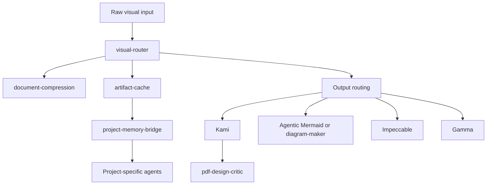

# Visual Document Skill Pack

A thin orchestration pack for producing professional PDF/HTML deliverables and managing reusable visual knowledge assets.

## Architecture

The pack separates input understanding, reusable assets, project discovery, and output production.



## Skills

| Skill | Role |
|---|---|
| **visual-router** | Classifies visual-document work and selects the smallest suitable workflow. |
| **document-compression** | Structures long PDFs, scans, and image collections for reliable reuse. |
| **artifact-cache** | Stores reusable extracted assets with source references. |
| **project-memory-bridge** | Connects reusable assets to project-specific agents. |
| **Kami** | Produces composed documents and PDFs. |
| **pdf-design-critic** | Reviews the final PDF after composition. |
| **Agentic Mermaid** | Creates and verifies deterministic Mermaid diagrams. |
| **diagram-maker** | Creates free-form SVG/HTML and editable Excalidraw diagrams. |
| **Impeccable** | Guides product UI design, critique, deterministic detection, and bounded repair. |
| **Host image generation** | Optional source for a small number of editorial images. |
| **Gamma** | Optional production route for slide-first or card-based output. |

## Routing

### Input

- Large PDF/image/Page collections or repeated document analysis → **document-compression**.
- Reused assets → **artifact-cache**.
- Cross-project discovery → **project-memory-bridge**.
- A bounded screenshot, short document, or targeted lookup → direct inspection.

### Output

- Professional PDF/report/white paper/one-pager → **Kami**, then **pdf-design-critic** for substantial deliverables.
- Formal architecture, workflow, topology, or lifecycle diagram → **Agentic Mermaid** when deterministic Mermaid output and structural verification are useful.
- Free-form concept map, architecture SVG, or editable whiteboard → **diagram-maker / Excalidraw**.
- Product UI/dashboard/frontend → **Impeccable**. Keep durable product truth in `PRODUCT.md` separate from surface direction in `DESIGN.md`.
- Report containing a diagram → choose the diagram tool by semantics, embed it in **Kami**, then run **pdf-design-critic** on the final composition.
- Slide-first visual storytelling → **Gamma**.
- Ordinary chat answers should not invoke visual-document tooling.

## Design principle

Keep capabilities separate and independently updateable. Let the routing layer coordinate them without merging them into one monolith.

The input-asset flow is:

```
raw visual input → document-compression → artifact-cache → project-memory-bridge → analysis / production agents
```

## Repository layout

- `skills/visual-router/SKILL.md` — orchestration rules.
- `skills/document-compression/SKILL.md` — document/image compression workflow.
- `skills/artifact-cache/SKILL.md` — reusable asset conventions.
- `skills/project-memory-bridge/SKILL.md` — project discovery and routing rules.
- `skills/pdf-design-critic/SKILL.md` — final PDF quality review.
- `upstream/manifest.json` — upstream sources, installed versions, and verification date.
- `tests/visual-production-smoke-tests.md` — smoke-test scenarios and pass criteria.
- `tests/visual-production-smoke-run-2026-09-24.md` — latest installation and test record.
- `AGENTS.md` — guidance for agents working in this repository.

Run `bash scripts/verify.sh` to check the core local skills. See the smoke-test run record for upstream version details and test limitations.

## Upstream projects

- [Kami](https://github.com/tw93/Kami)
- [diagram-maker](https://github.com/c0ng-web/codex-skill/tree/main/skills/diagram-maker)
- [Impeccable](https://github.com/pbakaus/impeccable)
- [Agentic Mermaid](https://github.com/adewale/agentic-mermaid)

Third-party source is not vendored by default. The pack keeps orchestration separate so upstream licenses and updates remain clear.
